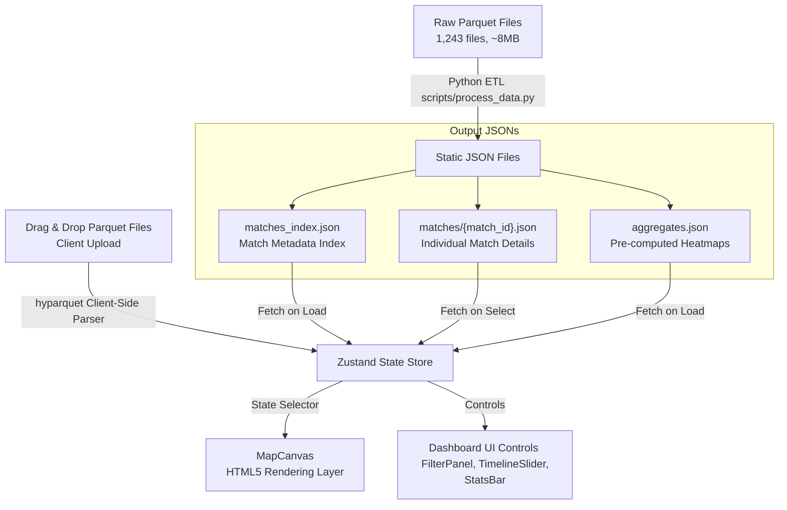

# LILA Player Journey Visualizer — Architecture Document

This document outlines the architecture, data pipeline, coordinate mapping system, design decisions, assumptions, and tradeoffs of the LILA Player Journey Visualizer.

---

## 1. System Topology & Data Flow

The visualizer is built as a **static-first React application** inside the Next.js framework. To optimize for speed, load time, and cost-efficiency, all raw match data (parquet files) is pre-processed into static JSON files at build time. The client browser fetches these static files on demand.

In addition, level designers can drop raw `.parquet` tracking files directly into the web interface. These are processed entirely in the browser and visualized instantly.

### Key Technical Choices
*   **Frontend Framework**: Next.js 16 (React 19) + TypeScript for solid type safety and structural standards.
*   **State Management**: Zustand for clean, boilerplate-free global state coordination.
*   **Rendering Layer**: HTML5 Canvas. Rendering ~89,000 coordinates over a timeline would create serious DOM lag using SVG. HTML5 Canvas handles this scale with sub-millisecond redraws.
*   **Heatmap Engine**: `simpleheat`, a lightweight, high-performance canvas-based heatmap library.
*   **Client-Side Parquet Parser**: `hyparquet`, a pure Javascript Parquet reader. Enables direct in-browser reading of binary `.parquet` logs, eliminating the need for a file upload backend.
*   **Styling**: Tailwind CSS + Custom CSS (`globals.css`) for a premium gaming dashboard theme (cyberpunk dark palette, glassmorphism, glowing accents).

---

## 2. Coordinate Mapping System

The game client logs coordinates in a 3D coordinate space $(x, y, z)$ where:
*   **x** = horizontal position (mapped to canvas $X$-axis).
*   **y** = elevation (ignored for 2D visualizer representation).
*   **z** = vertical depth/position (mapped to canvas $Y$-axis).

### Map Scaling Configurations
Each of the three maps has its own unique scale factor and world origin:

| Map ID | Scale | Origin X | Origin Z |
| :--- | :--- | :--- | :--- |
| **AmbroseValley** | 900 | -370 | -473 |
| **GrandRift** | 581 | -290 | -290 |
| **Lockdown** | 1000 | -500 | -500 |

### Coordinate Transformation Formula
To map game coordinates to canvas coordinates:
1.  **Normalize to $0.0 - 1.0$:**
    $$u = \frac{x - \text{origin}_x}{\text{scale}}$$
    $$v = \frac{z - \text{origin}_z}{\text{scale}}$$
2.  **Scale to Canvas (1024px) & Flip Y:**
    $$\text{pixel}_x = u \times 1024$$
    $$\text{pixel}_y = (1 - v) \times 1024$$

*Note: We flip the Y-axis ($1 - v$) because the screen coordinate system starts from the top-left $(0,0)$, whereas the game coordinate system starts from the bottom-left.*

### Resizing Minimaps
To avoid runtime scaling math and complexity, the raw minimap assets (ranging from 2160px to 9000px) are pre-resized to exactly $1024 \times 1024$ pixels. This guarantees that pixel coordinates map directly to canvas pixel drawing coordinates.

---

## 3. Key Assumptions

| Assumption | Rationale |
| :--- | :--- |
| **`ts` represents seconds from epoch** | Although pandas initially loads the parquet timestamp as `datetime64[ms]`, the raw integer values represent seconds from epoch (e.g. `1,770,754,537` which is exactly in February 2026). Removing the division by $10^6$ in the ETL script successfully recovers correct match timelines (spans of 200–800 seconds). |
| **Bot IDs are purely numeric** | Any `user_id` that can be cast to an integer (e.g. `14275`) is a bot, whereas UUID strings (e.g. `0019c582-...`) represent active human players. |
| **Event naming convention** | `BotKill` and `BotKilled` are the events generated when bots participate in combat. Humans killing bots triggers `BotKill` (from the human's perspective). Humans being killed by bots triggers `BotKilled`. |
| **Coordinates clamping** | Clamping coordinates to $[0, 1024]$ handles rare edge cases where players cross outside the active boundary lines. |
| **Phantom Bot Inference** | Analyzing raw match logs shows that 743 out of 796 matches have only 1 player tracking file (the human player) due to server-side telemetry loss. However, human logs contain numerous `BotKill` events, confirming bots were present. The visualizer infers 'phantom bots' from these combat events, placing their death locations on the map canvas and reflecting them in the `bot_count` metrics. |

---

## 4. Technical Tradeoffs

*   **Build-time ETL vs Runtime Server**:
    *   *Alternative*: A python API server (FastAPI) reading the parquet files on the fly.
    *   *Tradeoff*: A runtime server introduces API cold-starts, hosting costs, database connection issues, and slow processing. By compiling all data to static JSONs at build time, the visualizer is fully serverless, highly performant, can be hosted for free on Vercel, and handles thousands of concurrent users instantly.
*   **Per-Match JSON Files vs Monolithic JSON**:
    *   *Alternative*: Consolidating all matches and player paths into a single large JSON file.
    *   *Tradeoff*: A single monolithic JSON file containing 796 matches would be $>15\text{MB}$, resulting in massive load times. Instead, loading a small `matches_index.json` (~150KB) and fetching individual match details on-demand (~2KB per match) results in instant initial load and rapid match switching.
*   **HTML5 Canvas vs SVG**:
    *   *Alternative*: Rendering SVG polylines and rect elements inside the DOM.
    *   *Tradeoff*: SVGs are easy to style with CSS, but rendering 89,000 points dynamically on screen causes significant browser paint delays and DOM overhead. Canvas offers high-performance immediate-mode rendering, allowing fluid 60FPS timeline animations.
*   **Client-Side Parquet Parsing vs Server-Side Upload API**:
    *   *Alternative*: Uploading user parquet files to a Python backend, parsing them with pandas, and returning JSON.
    *   *Tradeoff*: A backend API incurs network latency (uploading multiple megabytes of raw files), storage/hosting costs, and privacy concerns. By parsing parquets directly in the browser using `hyparquet`, we achieve sub-second client-side parsing, zero backend resource utilization, and complete offline capability.

---

## 5. UI/UX Design System & Layout Architecture

*   **Responsive Multi-Accordion Sidebar**: To prevent UI elements from being pushed off-screen or truncated on smaller viewports (e.g. 1080p browser windows or laptop screens), the filters (Map, Dates, Layers) are wrapped in collapsible accordion blocks.
*   **Split Scrolling Contexts**: The FilterPanel employs nested overflow management:
    *   The top section (Map, Dates, Layers, Parquet Uploader) has its own scroll context (`overflow-y-auto`) to handle expanded filters.
    *   The bottom **Matches** list is pinned with a fixed height (`320px`) and independent scroll, guaranteeing it is always visible and choice card buttons remain clickable.
*   **Overlay Modals & Loading States**:
    *   **Empty State Canvas Overlay**: Displays a clear call to action to select a match or drop custom files when the application mounts.
    *   **Pulsing Loading State**: Renders a custom spinner overlay on the Canvas to indicate network/fetch delays when switching matches.
